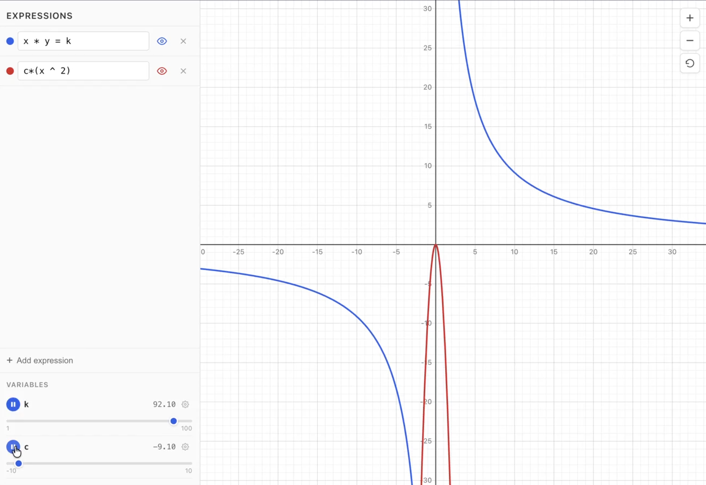

# geogebai graph calculator

A (mostly vibecoded) browser graphing calculator similar to [Desmos](https://www.desmos.com/) or [GeoGebra](https://www.geogebra.org/). It has interval slider controls for variables with animations.

